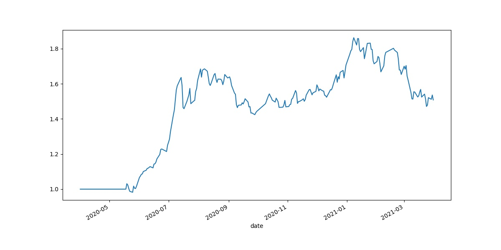

# Assignment3 : Machine Learning Factor Generator

*Selected Topic: Machine Learning*

## Brief Introduction

	This is an original machine learning factor generator, using Random Forest as an example.
	
## Structure
	*  data_generator:
		 * Extract data from data vendor at some frequency.
	*  data_handler
		* DataHandler: Concatenate factor data and return data. match and split into X and y for further process, also performing basic preprocess method such as filtering extreme values and standardize.
	*  factor_factary:
		*  Factor: Abstract Factory
		*  MLFactor: A factory of machine learning factors, implementing a very basic ML pipeline, including data splitting (into train data, validate data and test data, select according to usage)function and parts of returning and training each components of the data set.
		*  RandomForestFactor: Here a simple strategy is applied to form a factor: Label stocks whose daily change is at the 10% quantile to be 1, the last 10% quantile to be -1, else 0; predict the probability of new data to be labeled as 1; use the probability data as factor value.
		*  At each trading day, use historical data to train the model and use the factor data at that day to get factor value.
	
	*  performance:
		*  Input and preprocess the data.
		*  Evaluation:Calculate metrics of a factor.
	*  backtesting: 
		*  Input and preprocess the data.
		*  QuantilePortfolioConstruction: Build portfolio from the top quantile.
		*  Build portfolio and calculate the net value.
		*  Save the net value curve.

		
		

## Highlights
	*  A highly reusable structure, good for both adding functions and debugging
	*  Functional parts separated.

## Course Output
	* Design pattern: Factory, Template
	* Object-oriented form

## Outlooks
	*  Multi co-linearity analysis could be added into the data handler, to train the model better.
	*  Multiple machine learning methods could be added to the factory and used to construct the portfolio.
	* Other portfolio construction methods could be used, for example, equal weight.
